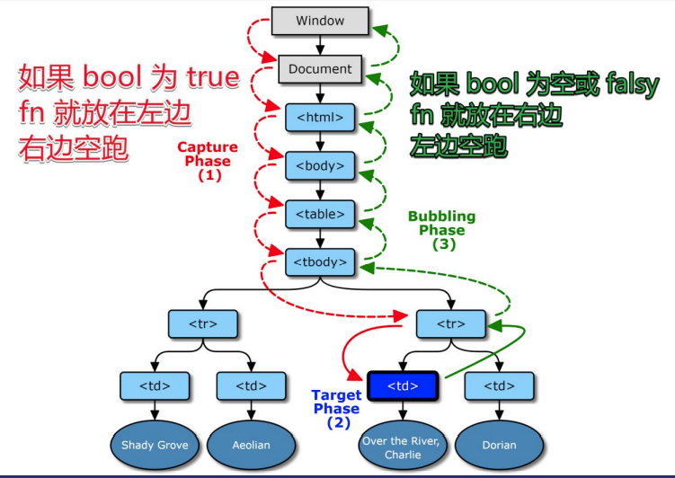

## 简述 DOM 事件模型或 DOM 事件机制

示例代码:
```html
    <div class="爷爷">
        <div class="爸爸">
            <div class="儿子">文字</div>
        </div>
    </div>
```

如果是这种有上下级关系的调用顺序是从里到外，还是从外到里?
<br>

因此W3C, 规定浏览器同时支持两种调用顺序。
<br>
通常都是先捕获，后冒泡。但是冒泡有些时候可以被阻止。

* 由外向内找监听函数, 叫事件捕获.
* 由内向外找监听函数, 叫事件冒泡.

DOM事件模型分为2个阶段:
1. 捕获阶段：事件从window对象自上而下向目标节点传播的阶段(示例代码中简化为: 爷爷->爸爸->儿子)；

2. 冒泡阶段：事件从目标节点自下而上向window对象传播的阶段(示例代码中简化为: 儿子->爸爸->爷爷)。

API为：
```JavaScript
xxx.addEventListener(eventType,fn,bool)
//如果bool为false,或者不填，则让fn走冒泡
//如果为true，则让fn走捕获
```


* 特例：请问先打印出1还是2
```JavaScript
div.addEventListener('click',()=>console.log('1'));//冒泡
div.addEventListener('click',()=>console.log('2'),true);//捕获
```

正常是先捕获，后冒泡。但是这个只有一个div，用户点击的元素就是监听的元素。这种情况下是按照谁先监听，谁先执行。所以这里先打印1

## 简述事件委托
事件委托是利用事件的冒泡原理来实现的，何为事件冒泡呢？就是事件从最深的节点开始，然后逐步向上传播事件，举个例子：页面上有这么一个节点树，div>ul>li>a;比如给最里面的a加一个click点击事件，那么这个事件就会一层一层的往外执行，执行顺序a>li>ul>div，有这样一个机制，那么我们给最外面的div加点击事件，那么里面的ul，li，a做点击事件的时候，都会冒泡到最外层的div上，所以都会触发，这就是事件委托，委托它们父级代为执行事件。
<br>
* 优点：
  * 可以减少监听数量（省内存）
  * 可以监听动态元素


封装事件委托：
```html
 <div id="div1">123</div>

    <script>
        setTimeout(()=>{
            const button = document.createElement('button')
            button.textContent='click1'
            div1.appendChild(button)
        },1000)


        on('click','#div1','button',()=>{
            console.log('button被点击了');
        })

        function on(eventType,element,selector,fn){
            console.log(element);//'#div1'
            if(!(element instanceof Element)){ //如果是选择器的话，就需要变成变为元素
                element= document.querySelector(element);
            }
            console.log(element);//null
            element.addEventListener(eventType,(e)=>{
                const t = e.target
                if(t.matches(selector)){
                    fn(e)
                }
            })
        }
    </script>
```


如果button里面还有子元素span，用户点击的是span,上面的代码就无法生效
```html
<div id="div1">
    <button>
        <span>123</span>
    </button>
</div>

<script>
    function on(eventType,element,selector,fn){
            if(!(element instanceof Element)){
                element = document.querySelector(element)
            }
            element.addEventListener(eventType,(e)=>{
                const t =e.target
                while(!t.matches(selector)){//如果用户点击的元素不等于我们想被用户点击的，则找他的上一级元素
                    if(t===element){ //如果找到最上一级都不等于，则为null
                        t=null
                        break
                    }
                    t=t.parentNode 
                }
                t&&fn.call(t,e,t) //如果t存在，则执行函数
            })
            return element
        }
</script>
```